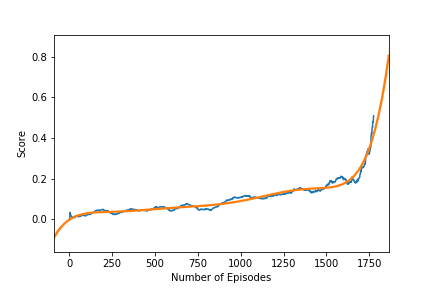
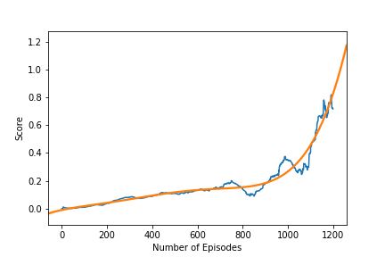

# Project 2: Continuous Control <!-- omit in toc --> 
[//]: # (Image References)

[image1]: https://user-images.githubusercontent.com/10624937/42135623-e770e354-7d12-11e8-998d-29fc74429ca2.gif "Trained Agent"
[image2]: https://user-images.githubusercontent.com/10624937/42135622-e55fb586-7d12-11e8-8a54-3c31da15a90a.gif "Soccer"


- [Introduction](#introduction)
- [Description](#description)
- [Results](#results)
  - [Building the Network Architecture](#building-the-network-architecture)
  - [Training the Model](#training-the-model)
- [Moving Forward](#moving-forward)

# Introduction

For this project, we work with the [Tennis](https://github.com/Unity-Technologies/ml-agents/blob/master/docs/Learning-Environment-Examples.md#tennis) environment.

![Trained Agent][image1]

In this environment, two agents control rackets to bounce a ball over a net. If an agent hits the ball over the net, it receives a reward of +0.1.  If an agent lets a ball hit the ground or hits the ball out of bounds, it receives a reward of -0.01.  Thus, the goal of each agent is to keep the ball in play.

The observation space consists of 8 variables corresponding to the position and velocity of the ball and racket. Each agent receives its own, local observation.  Two continuous actions are available, corresponding to movement toward (or away from) the net, and jumping. 

The task is episodic, and in order to solve the environment, your agents must get an average score of +0.5 (over 100 consecutive episodes, after taking the maximum over both agents). Specifically,

- After each episode, we add up the rewards that each agent received (without discounting), to get a score for each agent. This yields 2 (potentially different) scores. We then take the maximum of these 2 scores.
- This yields a single **score** for each episode.

The environment is considered solved, when the average (over 100 episodes) of those **scores** is at least +0.5.

# Description
To solve this problem, we built a **multi agent system** that uses a **Deep Deterministic Policy Gradient (DDPG)** algorithm which follows an **actor-critic** methodology. 

A multi-agent system where multiple agents interact with one another. The multi-agent case is a very complex kind of environment because all the agents are learning simultaneously and also interacting. 

In DDPG, we use two deep neural networks. We can call one the actor and the other the critic. It could be seen as approximate DQN. The **critic** is used to approximate the maximizer over the Q values of the next state. The **actor** here is used to **approximate the optimal policy deterministically**. That means we want to always output the best believed action for any given state. This is unlike a stochastic policies in which we want the policy to learn a probability distribution over the actions. 

In DDPG, we have a deterministic policy or in other words, we want the believed best action every single time we query the actor network. The actor is learning the $argmax_a Q(S, a)$, which is the best action. The critic learns to evaluate the optimal action value function by using the actors best believed action. 

Additionally, we use of a **replay buffer**, and **soft updates** to the target networks. In DDPG, you have **two copies of your network weights** for each network, a regular for the actor, an irregular for the critic, and a target for the actor, and a target for the critic. we update the **target** networks using **soft updates**. A soft update strategy consists of slowly blending your regular network weights with your target network weights. 

In **Experience Replay**, instead of discarding the **state-action-reward-next_state tuple** at each time step, a **replay buffer** *stores* those tuples (in our case, **100000** tuples). We store each experienced tuple in this buffer as we are interacting with the environment and then sample a small batch of tuples from it in order to learn. As a result, we are able to learn from individual tuples multiple times.

# Results

## Building the Network Architecture
Importing the Deep Q-Network Agent and building the architecture based on specific hyperparameters

- Actor:
  - 1 hidden layers:
      - (2 * Number of States=24, 256)
      - (256, 128)
      - (128, Number of Actions=2)
  - A learning rate of 1e-3
- Critic:
  - 1 hidden layers:
      - (2 * Number of States=24, 256)
      - (256 + 2 * Number of Actions=2, 128)
      - (128, 1)
  - A learning rate of 1e-3
- A batch size of 128
- buffer size: 1e6

```python
Number of agents: 2
Size of each action: 2
There are 2 agents. Each observes a state with length: 24

print(agent.actor_local)
Actor(
  (fc1): Linear(in_features=48, out_features=256, bias=True)
  (fc2): Linear(in_features=256, out_features=128, bias=True)
  (fc3): Linear(in_features=128, out_features=2, bias=True)
)

print(agent.critic_local)
Critic(
  (fcs1): Linear(in_features=48, out_features=256, bias=True)
  (fc2): Linear(in_features=260, out_features=128, bias=True)
  (fc3): Linear(in_features=128, out_features=1, bias=True)
)
```

## Training the Model
Training the agent based on the following hyperparameters:

```python
BUFFER_SIZE = int(1e6)  # replay buffer size
BATCH_SIZE = 128        # minibatch size
LR_ACTOR = 1e-3         # learning rate of the actor
LR_CRITIC = 1e-3        # learning rate of the critic
WEIGHT_DECAY = 0        # L2 weight decay
LEARN_NUM = 5           # number of learning passes
GAMMA = 0.99            # discount factor
TAU = 8e-3              # for soft update of target parameters
OU_SIGMA = 0.2          # Ornstein-Uhlenbeck noise parameter, volatility
OU_THETA = 0.15         # Ornstein-Uhlenbeck noise parameter, speed of mean reversion
EPS_START = 5.0         # initial value for epsilon in noise decay
EPS_EP_END = 300        # episode to end the noise decay process
EPS_FINAL = 0 # final value for epsilon after decay
```

We only tested changing the number of layers and the number of nodes per layers and couldn't test other hyper-parameters due to how long training took. We tried multiple **batch_sizes** but anything above 32 was too slow to train, this already took nearly a whole day on my machine. 

    Episodes 0000-0100	Scores: 0.018
    Episodes 0100-0200	Scores: 0.047
    Episodes 0200-0300	Scores: 0.034
    Episodes 0300-0400	Scores: 0.044
    Episodes 0400-0500	Scores: 0.057
    Episodes 0500-0600	Scores: 0.043
    Episodes 0600-0700	Scores: 0.071
    Episodes 0700-0800	Scores: 0.051
    Episodes 0800-0900	Scores: 0.081
    Episodes 0900-1000	Scores: 0.108
    Episodes 1000-1100	Scores: 0.105
    Episodes 1100-1200	Scores: 0.118
    Episodes 1200-1300	Scores: 0.134
    Episodes 1300-1400	Scores: 0.143
    Episodes 1400-1500	Scores: 0.163
    Episodes 1500-1600	Scores: 0.198
    Episodes 1600-1700	Scores: 0.232
    --- Environment solved in 1676 episodes!             
    --- Scores: 0.510 over past 100 episodes




A second run yielded:



# Moving Forward
We would like to explore a more complex environment all together, where the goal is to move a 2 vs 2 agents in a soccer game. Additionally, we would like to explore more algorithms, such as a deeper dive into alphazero and OpenAI algorithms to get intuitions in how to improve our performance.