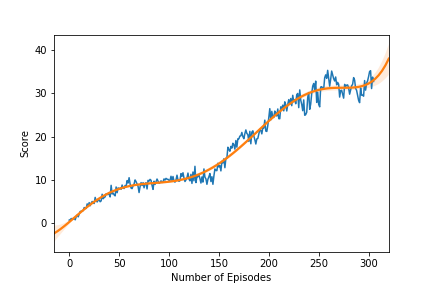

# Project 2: Continuous Control <!-- omit in toc --> 

[//]: # (Image References)

[image1]: https://user-images.githubusercontent.com/10624937/43851024-320ba930-9aff-11e8-8493-ee547c6af349.gif "Trained Agent"
[image2]: https://user-images.githubusercontent.com/10624937/43851646-d899bf20-9b00-11e8-858c-29b5c2c94ccc.png "Crawler"

- [Introduction](#introduction)
- [Description](#description)
- [Results](#results)
  - [Building the Network Architecture](#building-the-network-architecture)
  - [Training the Model](#training-the-model)
- [Moving Forward](#moving-forward)

# Introduction

For this project, you will work with the [Reacher](https://github.com/Unity-Technologies/ml-agents/blob/master/docs/Learning-Environment-Examples.md#reacher) environment.

![Trained Agent][image1]

In this environment, a double-jointed arm can move to target locations. A reward of +0.1 is provided for each step that the agent's hand is in the goal location. Thus, the goal of your agent is to maintain its position at the target location for as many time steps as possible.

The observation space consists of 33 variables corresponding to position, rotation, velocity, and angular velocities of the arm. Each action is a vector with four numbers, corresponding to torque applicable to two joints. Every entry in the action vector should be a number between -1 and 1.

The environment contains 20 identical agents, each with its own copy of the environment. The objective is to get an average score of +30 (over 100 consecutive episodes, and over all agents).  Specifically,
- After each episode, we add up the rewards that each agent received (without discounting), to get a score for each agent.  This yields 20 (potentially different) scores.  We then take the average of these 20 scores. 
- This yields an **average score** for each episode (where the average is over all 20 agents).

The environment is considered solved, when the average (over 100 episodes) of those average scores is at least +30. 

# Description
To solve this problem, we use a **Deep Deterministic Policy Gradient (DDPG)** algorithm which uses an **actor-critic** methodology. In DDPG, we use two deep neural networks. We can call one the actor and the other the critic. It could be seen as approximate DQN. The **critic** is used to approximate the maximizer over the Q values of the next state. The **actor** here is used to **approximate the optimal policy deterministically**. That means we want to always output the best believed action for any given state. This is unlike a stochastic policies in which we want the policy to learn a probability distribution over the actions. 

In DDPG, we have a deterministic policy or in other words, we want the believed best action every single time we query the actor network. The actor is learning the $argmax_a Q(S, a)$, which is the best action. The critic learns to evaluate the optimal action value function by using the actors best believed action. 

Additionally, we use of a **replay buffer**, and **soft updates** to the target networks. In DDPG, you have **two copies of your network weights** for each network, a regular for the actor, an irregular for the critic, and a target for the actor, and a target for the critic. we update the **target** networks using **soft updates**. A soft update strategy consists of slowly blending your regular network weights with your target network weights. 

In **Experience Replay**, instead of discarding the **state-action-reward-next_state tuple** at each time step, a **replay buffer** *stores* those tuples (in our case, **100000** tuples). We store each experienced tuple in this buffer as we are interacting with the environment and then sample a small batch of tuples from it in order to learn. As a result, we are able to learn from individual tuples multiple times.

# Results

## Building the Network Architecture
Importing the Deep Q-Network Agent and building the architecture based on specific hyperparameters

- Actor:
  - 1 hidden layers:
      - (Number of States=33, 256)
      - (256, 128)
      - (128, Number of Actions=4)
  - A learning rate of 1e-4 
- Critic:
  - 2 hidden layers:
      - (Number of States=33, 256)
      - (256 + Number of Actions=4, 128)
      - (128, 128)
      - (128, 1)
  - A learning rate of 3e-4 
- A batch size of 32
- buffer size: 1e6

```python
Number of agents: 20
Size of each action: 4
There are 20 agents. Each observes a state with length: 33

print(agent.actor_local)
>>> My_Network(
      (hidden_layers): ModuleList(
        (0): Linear(in_features=33, out_features=256, bias=True)
        (1): Linear(in_features=256, out_features=128, bias=True)
      )
      (output): Linear(in_features=128, out_features=4, bias=True)
      (batchnorm): BatchNorm1d(33, eps=1e-05, momentum=0.1, affine=True, track_running_stats=True)
    )

print(agent.critic_local)
>>> My_Network(
      (hidden_layers): ModuleList(
        (0): Linear(in_features=33, out_features=256, bias=True)
        (1): Linear(in_features=260, out_features=128, bias=True)
        (2): Linear(in_features=128, out_features=128, bias=True)
      )
      (output): Linear(in_features=128, out_features=1, bias=True)
      (batchnorm): BatchNorm1d(33, eps=1e-05, momentum=0.1, affine=True, track_running_stats=True)
    )
```

## Training the Model
Training the agent based on the following hyperparameters:

```python
NEGATIVE_SLOPE = 0.01
BUFFER_SIZE = int(1e6)  # replay buffer size
BATCH_SIZE = 32       # minibatch size
GAMMA = 0.99            # discount factor
TAU = 1e-3              # for soft update of target parameters
LR_ACTOR = 1e-4         # learning rate of the actor 
LR_CRITIC = 3e-4        # learning rate of the critic
WEIGHT_DECAY = 0.0001   # L2 weight decay
```

We only tested changing the number of layers and the number of nodes per layers and couldn't test other hyper-parameters due to how long training took. We tried multiple **batch_sizes** but anything above 32 was too slow to train, this already took nearly a whole day on my machine. 

    Training on cuda:0 started...
    Episode: 10	Average Score: 1.12	Current Score: 1.45
    Episode: 20	Average Score: 2.16	Current Score: 3.89
    Episode: 30	Average Score: 3.07	Current Score: 5.31
    Episode: 40	Average Score: 3.80	Current Score: 6.60
    Episode: 50	Average Score: 4.48	Current Score: 8.16
    Episode: 60	Average Score: 5.15	Current Score: 9.29
    Episode: 70	Average Score: 5.71	Current Score: 8.502
    Episode: 80	Average Score: 6.09	Current Score: 9.91
    Episode: 90	Average Score: 6.46	Current Score: 9.730
    Episode: 100	Average Score: 6.80	Current Score: 10.15
    Episode: 110	Average Score: 7.70	Current Score: 9.989
    Episode: 120	Average Score: 8.44	Current Score: 11.59
    Episode: 130	Average Score: 9.01	Current Score: 10.75
    Episode: 140	Average Score: 9.45	Current Score: 10.16
    Episode: 150	Average Score: 9.86	Current Score: 13.86
    Episode: 160	Average Score: 10.43	Current Score: 17.56
    Episode: 170	Average Score: 11.31	Current Score: 19.52
    Episode: 180	Average Score: 12.47	Current Score: 20.49
    Episode: 190	Average Score: 13.51	Current Score: 19.60
    Episode: 200	Average Score: 14.70	Current Score: 22.62
    Episode: 210	Average Score: 16.21	Current Score: 26.41
    Episode: 220	Average Score: 17.79	Current Score: 27.49
    Episode: 230	Average Score: 19.59	Current Score: 30.01
    Episode: 240	Average Score: 21.28	Current Score: 29.10
    Episode: 250	Average Score: 23.15	Current Score: 30.32
    Episode: 260	Average Score: 24.89	Current Score: 35.35
    Episode: 270	Average Score: 26.43	Current Score: 32.57
    Episode: 280	Average Score: 27.48	Current Score: 31.98
    Episode: 290	Average Score: 28.65	Current Score: 29.55
    Episode: 300	Average Score: 29.52	Current Score: 32.94
    Episode: 306	Average Score: 30.05	Current Score: 32.78
    Environment solved in 206 episodes!	Average Score: 30.05





# Moving Forward
We would like to explore a more complex environment all together, where the goal is to move a 4 legged creature. Additionally, we would like to explore more algorithms:
- A3C
- A2C
- GAE