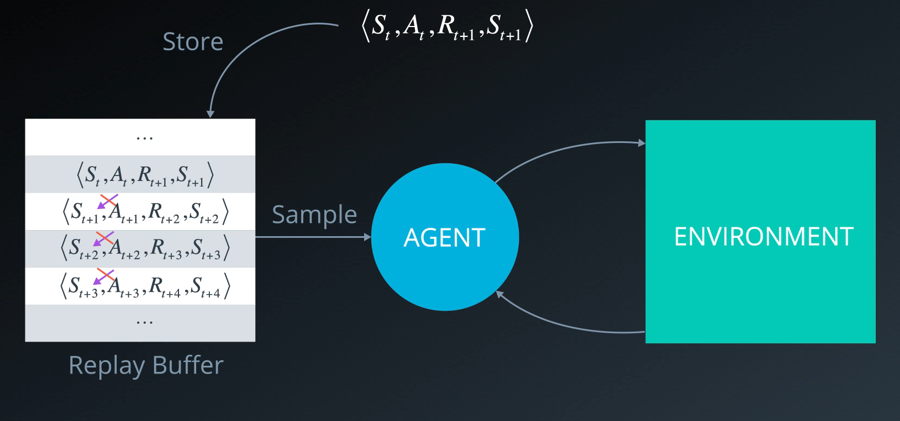
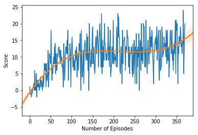

# Project 1: Navigation <!-- omit in toc --> 

[//]: # (Image References)

[image1]: https://user-images.githubusercontent.com/10624937/42135619-d90f2f28-7d12-11e8-8823-82b970a54d7e.gif "Trained Agent"

- [Introduction](#introduction)
- [Description](#description)
- [Results](#results)
  - [Building the Network Architecture](#building-the-network-architecture)
  - [Training the Model](#training-the-model)
- [Moving Forward](#moving-forward)

# Introduction

This project explores solution to solving a Unity virtual environement using Deep Reinforcement Learning, specifically a Deep Q-Network. The virtual environment is a space (large room) filled with two kinds of objects that needs to be collected or avoided. In this instance, the objective is to collect yellow bananas and avoid blue ones. 

Our agent will be trained based on the following parameters:

![Trained Agent][image1]

A reward of +1 is provided for collecting a yellow banana, and a reward of -1 is provided for collecting a blue banana.  Thus, the goal of your agent is to collect as many yellow bananas as possible while avoiding blue bananas.  

The state space has 37 dimensions and contains the agent's velocity, along with ray-based perception of objects around agent's forward direction.  Given this information, the agent has to learn how to best select actions.  Four discrete actions are available, corresponding to:
- **`0`** - move forward.
- **`1`** - move backward.
- **`2`** - turn left.
- **`3`** - turn right.

The task is episodic, and in order to solve the environment, your agent must get an average score of +13 over 100 consecutive episodes.

# Description

A **Deep Q Network** agent is a **deep neural network that acts as a function approximator**. You pass in inputs (state space), and it produces a vector of action values, with the max value indicating the action to take. As a reinforcement signal, it is fed back the change in score at each time step. At first, the neural network's weights and biases are initialized with random numbers but change over time as it begins to associate states with appropriate actions and learns to navigate the virtual environement.

**The Deep Q network is designed to produce a Q value for every possible action in a single forward pass.** However, such a network can become unstable due to the **high correlation between actions and states**. Let's discuss two methodologies to help with the issue:

- Experience Replay
- Fixed Q Targets

In **Experience Replay**, instead of discarding the **state-action-reward-next_state tuple** at each time step, a **replay buffer** *stores* those tuples (in our case, **100000** tuples). We store each experienced tuple in this buffer as we are interacting with the environment and then sample a small batch of tuples from it in order to learn. As a result, we are able to learn from individual tuples multiple times.




In **Fixed Q Targets**, we try to solve the correlation between the **target** and the **parameters** we are changing. When we train our network, the objective is to get closer to our target by updating our network's weights, $target=R + \gamma \max_{a} \hat{q} (S', a, \mathbf{w})$. However, we notice that our target is also dependent on our weights which leads to a highly variable target value. In order to stabilize our target, we build a second identical network whose weights are updated less often. In other words, the two networks are updated using the same equation but one updates less often. The final equation becomes:

$$
\Delta \mathbf{w} = \alpha \Big (R + \gamma \max_{a} \hat{q} (S', a, \mathbf{w}^-) - \hat{q} (S, A, \mathbf{w}) \Big ) \nabla_{\mathbf{w}} \hat{q} (S, A, \mathbf{w})
$$
with:
- $\mathbf{w}$ : The main network's weights
- $\mathbf{w^-}$ : The target network's weights
- $\mathbf{w^-} \leftarrow \mathbf{w}$ : at every time step (in our case, every **4** time steps)

Finally, we train our network using a **$\epsilon$-greedy policy**, meaning that the action is chosen based on a probability $\epsilon$ between a random action and an action decided by our network. At first we favor random actions in order to explore possibilities then as time goes on, $\epsilon$ decays to then favor our network's actions.

# Results

## Building the Network Architecture
Importing the Deep Q-Network Agent and building the architecture based on specific hyperparameters

- 3 hidden layers:
    - (Number of States=37, 512)
    - (512, 256)
    - (256, 128)
    - (128, Number of Actions=4)
- A batch size of 32
- A learning rate of 0.0005
- buffer size: 1e5
- target network updated every 4 time steps

```python
device = torch.device("cuda:0" if torch.cuda.is_available() else "cpu")
agent = DQN_Agent(state_size=state_size,
                  action_size=action_size,
                  hidden_layers=[512,256,128],
                  buffer_size=int(1e5),
                  batch_size=32,
                  gamma=0.99,
                  tau=1e-3,
                  lr=5e-4,
                  update_every=4,
                  drop_p=0.0,
                  device=device,
                  seed=0)
```

## Training the Model
Training the agent based on the following hyperparameters:
- $\epsilon$ decay rate of 0.95
    - Tested multiple values (0.995, 0.999, 0.99, 0.95). Iterating through these values improved the training speed the most.


```python
scores = train(agent=agent,
               env=env,
               n_episodes=2000,
               max_t=1000,
               eps_start=1.0,
               eps_end=0.005,
               eps_decay=0.95)
```

    Episode 100	Average Score: 6.11
    Episode 200	Average Score: 11.08
    Episode 300	Average Score: 11.69
    Episode 371	Average Score: 13.08
    Environment solved in 271 episodes!	Average Score: 13.08




# Moving Forward
We would like to explore a different approach, only using pixels (the video feed from the environment) as inputs instead of a well manufactured state space. Additionally, we would like to explore more complex methodologies:
- Double DQN
- Prioritized Experience Replay
- Dueling DQN
- Rainbow
